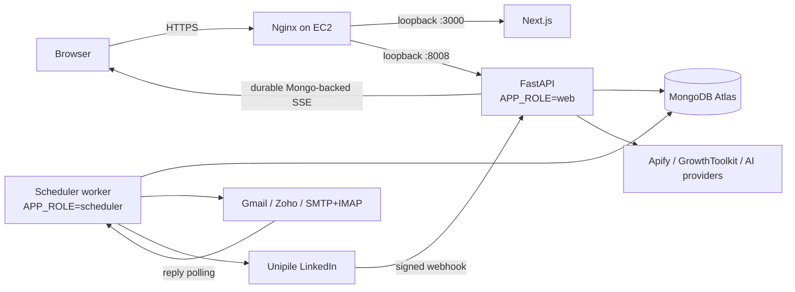
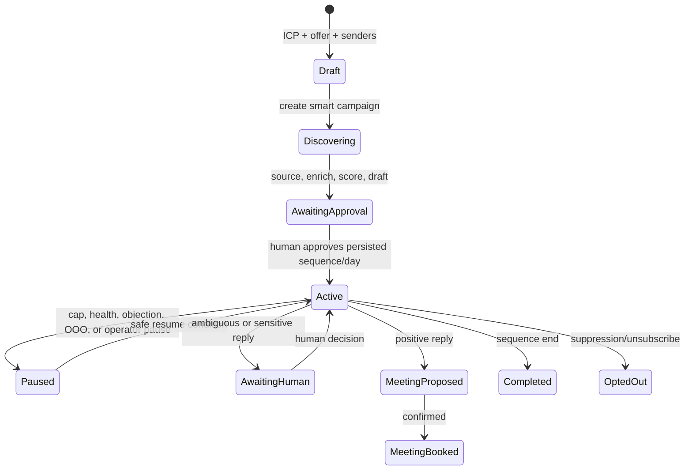

# OutFlo architecture

This document describes the launch architecture implemented in the repository.
It distinguishes durable foundations from work that still requires staging
proof. See [the deployment runbook](../deploy/README.md) for release gates.

## Product and tenancy contract

OutFlo is a guided-autopilot outreach agent for founder-led teams. The launch
channels are email and LinkedIn. A user reviews the audience, fit evidence,
messages, and multi-touch sequence before launch; the system then schedules
approved work, observes replies, and pauses or escalates when human judgment is
needed.

Every customer belongs to an `account`; membership is checked at the API
boundary. Tenant-scoped identifiers are stored as strings. A prospect's
presence in the shared pool is never evidence that an account may view or
mutate its tenant state.

The data layers are:

```text
companies + prospects                 canonical, tenant-neutral shared pool
        |
        +-- prospect_state             (account, prospect) overlay
        |                               notes, status, tags, ownership/use
        |
        +-- campaign_prospect_state    (account, campaign, prospect, score version)
                                        fit, score evidence, cohort, enrichment state
```

Canonical company mutations are privileged. Tenant edits belong in overlays.
Campaign fit is versioned and campaign-scoped: `0` means scored with no fit;
`null` means unscored or unavailable. Neither is inferred from a historical
global score.

## Production topology



The controlled launch deployment is one encrypted EC2 instance with three
non-root systemd services, Nginx TLS termination, and Atlas outside the host.
API and scheduler processes are separate. This is not multi-AZ or zero
downtime; scaling and availability triggers are in the deploy runbook.

## Guided-autopilot state flow



`sequence_graph_v1` is the canonical multi-touch contract. Launch and day
approval fail before provider side effects when the stored graph is absent or
invalid. The post-launch graph is read-only; changes require an explicit future
version rather than mutating the meaning of already-sent nodes.

## Discovery, enrichment, and scoring

Smart discovery sources companies, scrapes candidate employees, enriches
contact data, writes tenant-neutral facts to the shared pool, and records
campaign decisions in `campaign_prospect_state`. Shared prospects are rescored
for each campaign. Enrichment states are explicit: `queued`, `running`,
`succeeded`, `not_found`, `retryable_failure`, `blocked`, or `exhausted`.

The durable `jobs` queue provides tenant-scoped deterministic keys, atomic
leases, heartbeat/checkpoint, retry, cancellation, and dead-letter states.
Prospect enrichment is integrated with this queue through the 15-second
`enrichment_job_dispatcher`. Other discovery and generation paths still have
legacy background/resume behavior; they are not described as fully durable.

## Sending and safety boundary

The scheduler claims due enrollments and binds each provider action to the
campaign's tenant-owned email or LinkedIn account. A send is identified by:

```text
(enrollment_id, sequence_version, node_id, generation)
```

`send_attempts` moves through `prepared → dispatching → sent`. Failures before
the provider boundary may be scheduled for retry. A timeout or crash after the
boundary becomes `ambiguous` and must be reconciled from provider evidence;
the system must not blindly resend it. `campaign_messages.send_key` prevents a
replayed successful attempt from incrementing counters twice.

Campaign-level and sender-counter channel caps exist for email, LinkedIn
connection, InMail, and LinkedIn message. Email and LinkedIn accounts are
PATCH-configurable and default into warm-up with a start time. Effective limits
are clamped by warm-up and provider/product ceilings; atomic sender reservation
also advances the channel's `next_send_not_before` throttle. Launch still
requires multi-worker and real-provider proof. Until that proof and
ambiguous-send reconciliation exist, provider sending is a no-go.

## Conversations, replies, and notifications

Conversation identity is canonical within a tenant and provider account:

```text
(account_id, channel, provider_account_id, provider_thread_id)
```

Provider message IDs are replay-protected. LinkedIn inbound events require a
signed webhook and resolve the exact connected provider account. Email replies
are polled from connected Gmail, Zoho, or SMTP+IMAP accounts. Reply
classification updates the enrollment state machine, suppression status,
meeting flow, and a tenant-scoped notification.

Notifications are persisted before delivery. SSE validates current membership,
replays from `Last-Event-ID`, and polls ordered Mongo records, so a scheduler
event is visible to the web process and survives refresh. It is not a
process-local queue. Browser SSE authentication uses the same HttpOnly session
cookie as the JSON API; no bearer credential is placed in the query string.

Google bookings persist an exact tenant email-account, calendar and event
binding. Signed watch events and the bounded scheduler fallback claim each due
meeting with a lease, fetch only that bound event, and apply cancellation,
attendee response or changed start/end state through an event fingerprint.
Provider failures schedule retry without changing meeting state; legacy
unbound events are skipped pending reviewed backfill.

## Scheduler and durable coordination

APScheduler supplies cadence, while Mongo supplies durable business state.
Current jobs are campaign execution (5m), enrichment dispatch (15s), LinkedIn
connection/reply polling (5m), email reply polling (5m), reply classification
(20s), daily statistics/cap reset, OOO/no-confirm/cascade checks, and Google
Calendar polling/watch renewal. `scheduler_heartbeats` records last outcome.

Only one scheduler service is enabled in the single-host launch topology.
Before adding scheduler replicas, prove atomic job and due-enrollment claims,
install all send-attempt indexes, and verify that no legacy scheduler path can
double-dispatch.

## Security boundaries

- Production startup fails closed on missing/placeholder secrets, debug/mock
  flags, wildcard hosts, insecure public URLs, or `APP_ROLE=all`.
- OAuth state is signed, tenant/provider/redirect-bound, expires after ten
  minutes, and uses a one-time Mongo nonce.
- Zoho data-center origins use an exact allowlist; arbitrary OAuth-returned
  hosts are rejected before network access.
- Unipile webhooks fail closed outside explicit development/test settings.
- OAuth/provider credentials are Fernet-encrypted at rest.
- Microsoft OAuth connect/exchange/refresh is launch-disabled (`410 Gone`).

These controls do not replace the no-go gates in the deployment runbook.
